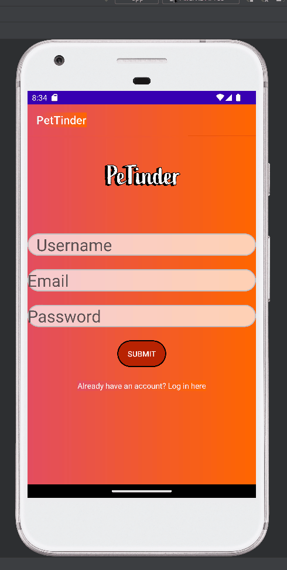
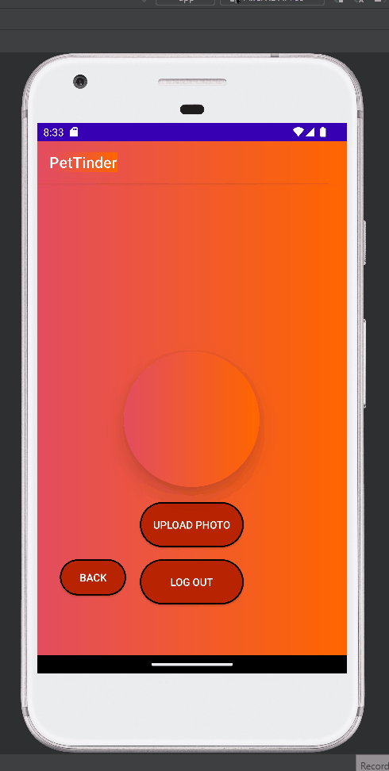

# Pet-Tinder
Pet Tinder App 
<!-- (This is a comment) INSTRUCTIONS: Go through this page and fill out any **bolded** entries with their correct values.-->

# AND101 Milestone 1 - **PetTinder by SpedRutz**

Submitted by:
- **Shane Douglas**
- **Eugene Senanu**
- **Liang Liu**

Time spent: **20** hours spent in total

## Summary

This document provides an overview, project spec, and wireframes for our team's capstone project: An app that **short description of your app**

If we had to describe this milestone in three (3) emojis, they would be: **emojis here**

## Milestone Requirements

<!-- Please be sure to change the [ ] to [x] for any features you completed.  If a feature is not checked [x], you might miss the points for that item! -->

The following REQUIRED features are completed:

- [x] Creation of GitHub Organization and Group Project Repo
- [x] Updated Course Portal group info with Group Name and App Description

The following REQUIRED files are included:

- [x] Included 📄 `brainstorming.md`, which contains:
  - [x] Our initial brainstorming ideas (6+ ideas)
  - [x] 5-category evaluation of our top 3 ideas
  - [x] Final app idea chosen
- [x] Included 📄 `project_spec.md`, which contains:
  - [x] App Overview: Description and evaluation
  - [x] App Spec: User features, Chosen API(s), User Interactions
  - [x] Wireframe image(s)

The following BONUS features are implemented:

- [x] Added digital wireframe/mockup image(s)
- [ ] Added a GIF of an interactive prototype

The following EXTRA features are implemented:

- [ ] List anything else that you added to improve your submission!

## Notes

Scehduled to be updated
# AND101 Milestone 2 - **SpedRutz: Team 24**

Submitted by:
- **Shane Douglas**
- **Liang Liu**
- **Eugune Senanu**

Time spent: **40** hours spent in total

## Summary

 **PeTinder**
 
 Application that utilizes the Pet Finder API to return a list of adoptable pets based on a given zip code. The app also utilhe built in firebase database for authentication, database, and storage.

## Milestone Requirements

<!-- Please be sure to change the [ ] to [x] for any features you completed.  If a feature is not checked [x], you might miss the points for that item! -->

The following REQUIRED features are completed:

- [x] Assign features to each member of your group
- [x] Establish a goal time for completing each feature
- Note: Both of these are in the project Spec

The following REQUIRED files are included:

- [x] Updated 📄 `project_spec.md`, which contains:
  - [X] App Overview (Milestone 1)
  - [X] App Spec (Milestone 1)
  - [x] Checked off 2+ completed features
  - [x] 2+ GIFs of build progress
  
  
## The App
 ### Login Activty
 
 
 ### Pet Finder Activity
 
 
 ### Profile Activty
 

- [x] Our 🎥 Demo Video
  - [x] We have also added the Demo Video Link to the Group Info Form on the course portal.

The following EXTRA features are implemented:

- [x] List anything else that you added to improve your submission!
- [x] Added a user profile activity
- [x] added a login activty
- [x] Several User activities

## 🎥 Demo Video

Here's a video that demos all of the app's implemented features:

VIDEO created with Loom

## Notes

App Came a long way. Will add a chatting feature for the final submisssion
